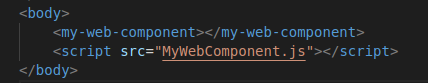
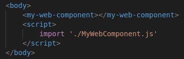
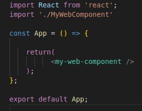
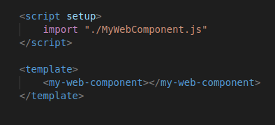
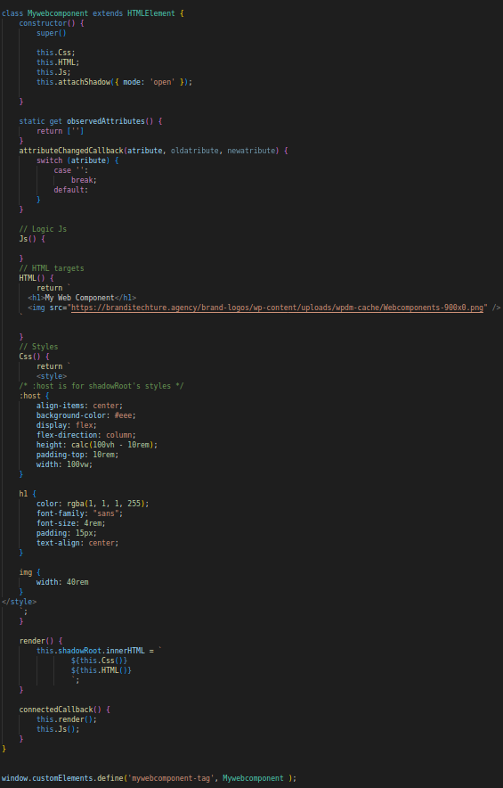

# new-web-component

## Description
This is a simple creator of a native Web Component

### Node.js
* Required 16.14.2 version or higher

### Install create-wc
* `$ npm i new-web-component -g`
### Execute 
* `$ create-wc`

`Write the name of your Web Component`

## HTML vanilla

## HTML + Webpack, Vite or another builder

## React

## Vue

<!-- 
`Angular`
 -->

## Result

## MyWebComponent.js

### Contact me
gastonmgrecco@gmail.com